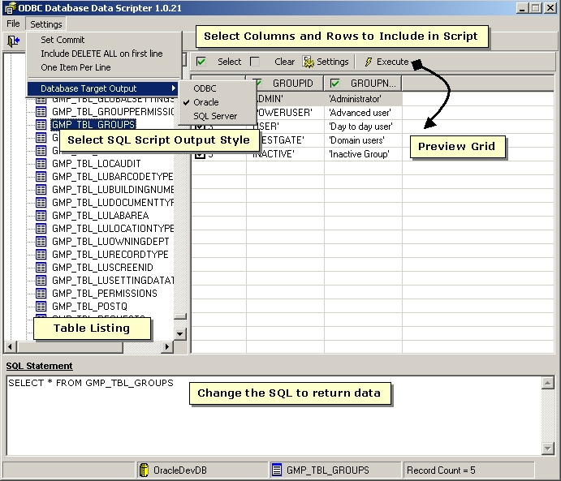



## ODBC Data Scripter

### Description

Create SQL Insert scripts for Oracle, SQL Server (not 100% tested for SQL Server) to populate a table. This was a quick and dirty tool to allow me to provide data from a test database to a client who did not have a DBA. I would e-mail him data scripts and he ran the scripts. Great for populating databases.

There is room for improvement and I have done about all that I want with this.
 
### More Info
 

             |
---                |---
**Submitted On**   |2003-12-16 10:37:28
**By**             |[Day Late, Dollar Short](https://github.com/Planet-Source-Code/PSCIndex/blob/master/ByAuthor/day-late-dollar-short.md)
**Level**          |Intermediate
**User Rating**    |5.0 (10 globes from 2 users)
**Compatibility**  |VB 6\.0
**Category**       |[Databases/ Data Access/ DAO/ ADO](https://github.com/Planet-Source-Code/PSCIndex/blob/master/ByCategory/databases-data-access-dao-ado__1-6.md)
**World**          |[Visual Basic](https://github.com/Planet-Source-Code/PSCIndex/blob/master/ByWorld/visual-basic.md)
**Archive File**   |[ODBC\_Data\_1724253252004\.zip](https://github.com/Planet-Source-Code/day-late-dollar-short-odbc-data-scripter__1-52635/archive/master.zip)

